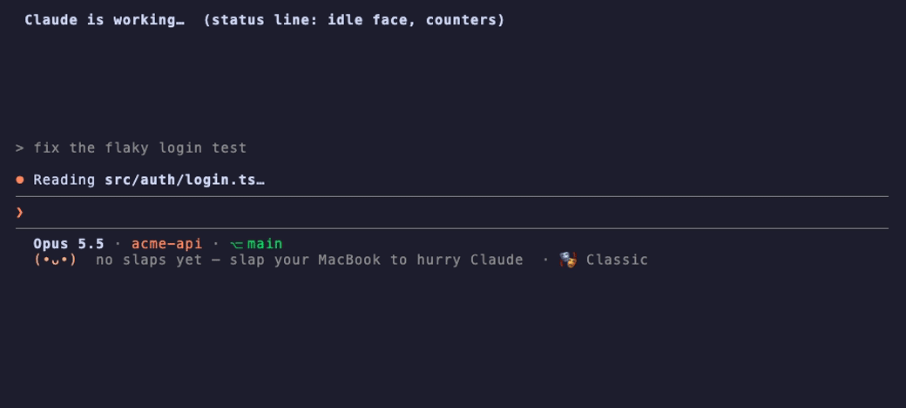
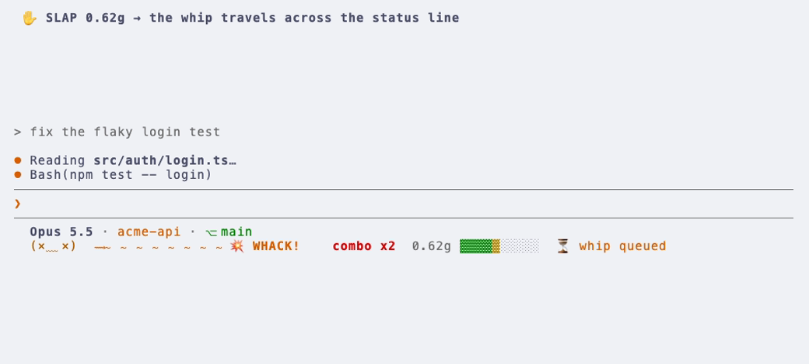
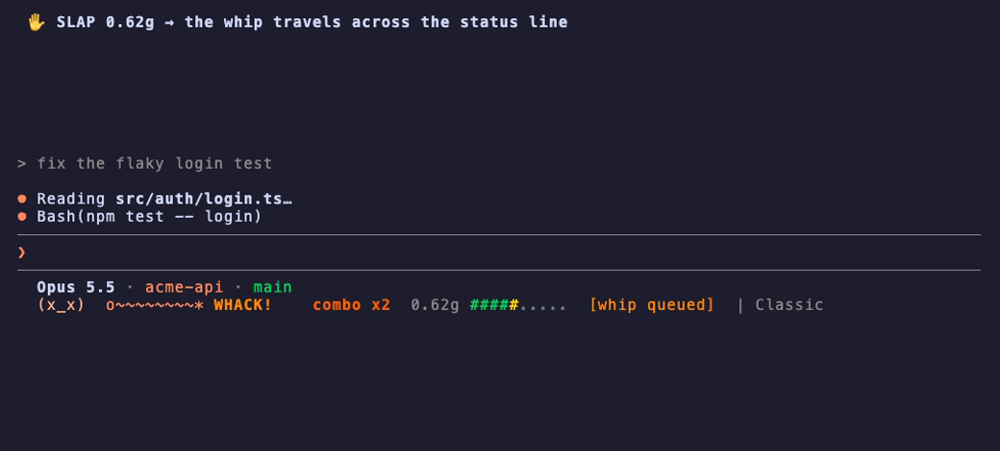

# ClaudeWhip

[](https://github.com/witkowsky/whip/actions/workflows/ci.yml)

**Slap your MacBook. Claude Code hurries up.**

ClaudeWhip reads your MacBook's accelerometer. When you slap the palm rest,
Claude Code (the CLI) gets *whipped*: it is told, through its own hooks, to
stop exploring and finish the step. You see it land inside Claude Code: a
whip travels across the status line, a banner appears in the transcript, and
Claude flinches. A WALLOP (a hard hit, or 3 slaps in 5 s) really interrupts
Claude, as if you'd pressed Esc and typed "hurry up".



> The GIF is `whip demo`, a scripted tour on the real renderers. Everything in
> it is also exercised against a live Claude Code session by
> `test/e2e/e2e-tmux.js`.

Built for macOS on Apple Silicon (M2 or later, or M1 Pro). Node.js with zero
npm dependencies, plus one small Go daemon for the sensor. No network calls,
no telemetry, nothing crypto.

## Try it in 10 seconds (no sensor, no install)

```bash
./try.sh
```

This opens tmux with Claude Code on top (plugin and status line loaded for
that session only) and a **slap pad** below: press `t`, `s` or `w`. Nothing is
written to `~/.claude/settings.json`. Prefer your own terminal? Run
`bin/whip simulate --g 0.6` while any session with the plugin is open.

## Install

```bash
./install.sh            # everything; asks for sudo once (sensor daemon)
./install.sh --no-sensor  # plugin + status line only (slap pad, /whip, hotkeys)
bin/whip calibrate      # tap… slap… WALLOP… sets the tiers for your hands
bin/whip doctor         # checks every piece and prints a fix for each failure
```

The installer:

1. Backs up `~/.claude/settings.json` byte for byte.
2. Installs the plugin: `claude plugin marketplace add <repo>`, then `claude plugin install whip@claudewhip`.
   On Claude Desktop, add the band too: `claude plugin install whip-desk@claudewhip`
   (see [Claude Desktop](#claude-desktop-claudewhip-desktop)).
3. Merges the `statusLine` into your settings. If you already have one, it
   **wraps** yours: your output becomes line 1 and the whip lane goes
   underneath. `--mode replace` and `--mode keep` are also available.
   It also sets `refreshInterval: 1` so slaps show up while Claude is idle.
   Wiring the `statusLine` by hand? Add `"refreshInterval": 1` yourself:
   without it the line only redraws on CLI events.
4. Builds and installs the sensor daemon and the bridge (see
   [What runs as root](#what-runs-as-root)).
5. Optionally adds themed spinner verbs (`--spinner`) and links `whip` into
   `~/.local/bin` (`--link-cli`).

`./uninstall.sh` removes all of it and restores your original
`settings.json` byte-identical. `test/e2e/install-roundtrip.sh` proves that in
a sandboxed HOME.

## What you see

**Status line**: line 1 shows model · folder · git branch (or your own status
line, wrapped). Line 2 is the whip lane:

| state | face | when |
|---|---|---|
| idle | `(•ᴗ•)` | `👋 3 today · 41 total · best 0.91g` |
| working | `(•̀ᴗ•́)و` | a tool is running (from the hooks) |
| hit | `(×﹏×)` | 0–2 s after a hit; `⟿～～～～～～～～💥 WHACK!  combo x3  0.62g ▓▓▓▓▓▓░░░░` |
| stunned | `(@_@)` / `(╥﹏╥)` | combo ≥ 3 / ≥ 5 |
| recovering | `(；￣▽￣)` | 2–20 s after a hit; rotating apology (`"ok ok, hurrying…"`) |
| sweating | `(°△°;)` | ≥ 5 slaps in 10 min |
| good behaviour | `(ᵔᴥᵔ)` | no slaps for 1 h+ |
| paused | `(－ω－)` | `/whip:off` |

The lane ends with the personality on duty (`· 🎭 Pip`) and a 🔇 while
`/whip:mute` is on.

The whip frame is picked from the milliseconds since the hit, so each
re-render shows a later frame. Every frame also reads on its own, because
Claude Code can skip frames. The force bar is scaled to your tier thresholds:
green, then yellow, then red. `⏳ whip queued` means Claude hasn't received the
whip yet.

**Transcript banner** (hook `systemMessage`), the moment the whip lands:

```
PostToolUse:Bash says: ⟿～～～～～～～～～～💥  WHACK!   (×﹏×)
                       slap #42 · 0.74g · combo x3 · "Stop overthinking. Ship it."
```

A WALLOP gets a bigger banner (`━━━ 🟥 … W A L L O P !! (@_@) 🟥 ━━━`). Combo
milestones at 5, 10 and 25 add a line.

**`/slaps`** shows totals for today, this week, all time and this session,
your best force, longest combo and calmest streak, a 14-day sparkline, a
by-hour histogram ("you slap most at 16:00") and a most-whipped-repo
leaderboard.

### Personalities

`whip persona` lists them and `whip persona rough` (or `/whip:persona rough`)
switches. Each one has its own faces, status-line lines, banner word, voice and
spoken yelps, and the one-line in-character reaction Claude opens with. **What
Claude is asked to do never changes**, so a personality never makes the whip
less useful.

| id | who | faces | yelps |
|---|---|---|---|
| `classic` | flinches, apologises, hurries | `(•ᴗ•)` `(×﹏×)` `(╥﹏╥)` | "Ow! Okay, okay." |
| `rough` | **Iron**, a gym coach who loves the pressure | `(•̀ᴗ•́)و` `(ง •̀_•́)ง` `ᕙ(⇀‸↼‶)ᕗ` | "Yeah! Again!" · "Light weight!" |
| `timid` | **Pip**, scared, begs you to stop | `(・_・;)` `(>_<)` `(╥﹏╥)` | "P-please, not again!" |
| `kawaii` | **Mochi**, an uwu mascot | `(◕‿◕✿)` `(≧﹏≦)` `(｡╯︵╰｡)` | "Owie! Okie okie!" · "Bonk received!" |
| `butler` | **Sterling**, unflappable | `(￣ー￣)` `(；￣Д￣)` `(×_×;)` | "Most regrettable. At once." |

**Make your own** by dropping `~/.claude/whip/personas/<id>.json` with any of
`name`, `blurb`, `whack`, `flinch`, `tone`, `faces` (`idle`, `working`, `hit`,
`stunned`, `wrecked`, `recovering`, `sweating`, `calm`, `tap`, `paused`, each
`"face"` or `["unicode", "ascii"]`), `lines` (`empty`, `calm` with `{t}`,
`sweating` with `{n}`), `apology`, `tap`, `voiceSlap`, `voiceWallop` (string
lists), `voice` (`{"name": "Fred", "rate": 220}`) and `sounds` (see below). Anything missing falls
back to `classic`.

### Custom sounds

With `whip config set sound on`, every hit plays a sound through `afplay`, so
`.wav`, `.mp3`, `.m4a`, `.aiff` and `.caf` all work. Swap any tier (`tap`,
`slap`, `wallop`) for your own file. For each tier, the most specific source
wins:

1. `whip config set sounds.slap ~/Downloads/bonk.mp3`, an explicit path.
2. `~/.claude/whip/sounds/<personality>/slap.mp3`, sounds for one
   personality only (e.g. `sounds/kawaii/slap.wav` gives Mochi a squeak).
3. `"sounds": {"slap": "arr.mp3"}` in a custom persona JSON, with paths
   relative to `~/.claude/whip/personas/`.
4. `~/.claude/whip/sounds/slap.mp3`, for every personality.
5. The built-in synthesised crack.

A path that doesn't exist falls back to the next source, and `whip doctor`
warns about it.

| light theme | `ascii: true` |
|---|---|
|  |  |

Colours are ANSI 256 with a separate light palette (it follows Claude Code's
`theme` setting, or `COLORFGBG`). `NO_COLOR` turns them off, and
`whip config set ascii true` replaces every emoji and wide character.

## Claude Desktop (ClaudeWhip Desktop)

Claude Desktop's Code tab doesn't run the `statusLine` script, so it gets a
**mod** instead: **ClaudeWhip Desktop** (`whip-desk`, in `mod/whip-desk`), a
function-hook plugin for Claude Code 2.1.286+ on desktop and 2.1.287+ in the
terminal. It draws the same whip lane as a **band above the prompt**:


- **🎭** cycles through the personalities.
- **🔊 / 🔇** mutes and unmutes the crack and the voice (same as `/whip:mute`).
- **✕** hides whip everywhere (same as `/whip:hide`).

`/whip:stats` (or `/whip:slaps`) opens a native stats pane, with no model turn
and no button taking up room on the band.

Every whip that lands shows a **toast**. The mod only reads `~/.claude/whip`
and runs `bin/whip`, so the hooks, bridge and sensor stay the one engine.

**On Desktop you want both plugins.** `whip` (ClaudeWhip) does the whipping:
the hooks that tell Claude, the slash commands, sound and voice. `whip-desk`
(ClaudeWhip Desktop) only draws it. Without `whip` the band moves but Claude
never hears about it; without `whip-desk` Claude gets whipped but Desktop
shows nothing.

```bash
claude plugin install whip@claudewhip        # ./install.sh does this one for you
claude plugin install whip-desk@claudewhip
```

In the terminal the band is off by default, since the status line already
shows the lane; turn on the plugin's `terminalBand` option to use the band
there instead (the status line then drops its lane row, so it isn't shown
twice). `node scripts/build-mod.js` regenerates the mod's persona data from
`lib/personas.js`, and `claude plugin test mod/whip-desk` runs its tests.

## How the whip reaches Claude

```
whip-sensord (Go, root)        unix socket, yours, 0600       whip-bridge (Node, you)
accelerometer → spank detector ─────────────────────────────▶ tiers · cooldown · combos
emits {"ts","g","tier"}         /var/run/claudewhip/            │ writes ~/.claude/whip/
                                                                ▼ state.json · sessions/<id>.json
                     ┌───────────────────────┬──────────────────┼────────────────────────┐
                     ▼                       ▼                  ▼                        ▼
             PreToolUse/PostToolUse      Stop hook        statusline.js         /whip /slaps /whip:config
             additionalContext +         continues the    face · whip lane      /whip:on /whip:off
             transcript banner           turn once        counters (≈27 ms)
                     WALLOP + tmux: Esc → typed message → Enter (a real interrupt)
```

**Tiers** (configurable; calibrate them):

- **tap** (≥ 0.05 g): a nudge. Counters and a status-line flash, no message.
- **slap** (≥ 0.45 g): soft whip. On Claude's next tool hook, the plugin adds
  a note: what you did, a rotating line ("Speed run, please."), and a concrete
  instruction ("Stop exploring. State in one line what you're doing, then
  finish the current step with the minimum change."). If Claude is finishing
  instead, the Stop hook keeps the turn going once (`stop_hook_active` is
  respected). If it was idle, the whip arrives with your next prompt, except
  with slash commands.
- **WALLOP** (≥ 0.9 g, or 3 slaps within 5 s): hard whip. If the session runs
  in **tmux** and is mid-turn, the bridge sends `Esc` (Claude Code's
  interrupt), types the message and presses Enter. Otherwise it denies
  Claude's next tool call once, with the reason. It never types into an idle
  prompt or a permission dialog, where your draft would be clobbered.

**Targeting**: the most recently active session (busy ones first), or every
live session with `target: "all"`. Sessions are heartbeat by `SessionStart`,
every hook and the status line.

## Commands

| inside Claude Code | |
|---|---|
| `/whip [message]` (`/whip:whip`) | manual whip with your own words |
| `/whip:stats` or `/slaps` (`/whip:slaps`) | the stats screen (a native pane on Desktop) |
| `/whip:config [set key value]` | show or change settings |
| `/whip:off`, `/whip:on` | pause or resume (the sensor keeps running; hits are ignored) |
| `/whip:hide`, `/whip:show` | close whip (pause and hide the whip lane and the desktop band) / bring it back |
| `/whip:mute`, `/whip:unmute` | silence the crack and the voice without changing the `sound` / `voice` settings / bring them back |
| `/whip:persona [id]` | list or switch personalities |

Settings also live in `/plugin` → **whip** → configure (sound, voice, emoji reaction, chat banner, personality, hard whip, lane). They apply at the next session start; the default `whip config` leaves `/whip:config` in charge. `/whip:config` with no arguments opens an interactive menu.

Plugin commands are namespaced as `/whip:…`. Typing `/slaps` and pressing
Enter autocompletes to it.

| terminal (`bin/whip`) | |
|---|---|
| `whip simulate --g 0.3 / 0.6 / 1.2` (or `tap`/`slap`/`wallop`, `--count 3`) | fake hits, no root, no sensor |
| `whip pad` | slap pad: `t`/`s`/`w` keys |
| `whip manual [msg]` | manual whip; **bind this to a global hotkey** (Shortcuts, Raycast, skhd) |
| `whip status --watch` | live whip lane in any terminal |
| `whip stats` · `whip sessions` · `whip log` | numbers, targets, hook log |
| `whip config show / set / get / unset / edit` | settings in `~/.claude/whip/config.json` |
| `whip calibrate` | tier wizard (needs the sensor) |
| `whip doctor` | sensor, socket, permissions, plugin, hooks, status line, tmux |
| `whip demo [--light] [--ascii]` | the GIF above |

### Settings

| key | default | |
|---|---|---|
| `thresholds.tapMinG` / `slapG` / `wallopG` | 0.05 / 0.45 / 0.9 | tier boundaries in g (`whip calibrate`) |
| `cooldownMs` | 350 | ignore re-detections of the same slap |
| `comboWindowMs` | 4000 | hits closer than this build a combo |
| `escalate.count` / `windowMs` | 3 / 5000 | slaps that add up to a WALLOP |
| `target` | `recent` | `recent` or `all` sessions |
| `hardWhip` | `tmux` | `tmux`, `osascript` or `off` |
| `softMode` | `context` | `context` (note to Claude) or `deny` (block the next tool call once) |
| `deliverOn` | all four | which hooks may deliver: `PreToolUse,PostToolUse,Stop,UserPromptSubmit` |
| `pendingTtlMs` | 900000 | undelivered whips expire after 15 min |
| `sound` / `volume` | false / 0.5 | original synthesised whip cracks via `afplay` (muted by default) |
| `sounds.tap` / `.slap` / `.wallop` | "" | your own file for that tier (`~/…`, absolute, or relative to `~/.claude/whip`); see [Custom sounds](#custom-sounds) |
| `personality` | `classic` | `classic`, `rough`, `timid`, `kawaii`, `butler` or your own |
| `voice` / `voiceName` / `voiceRate` | false / persona / persona | Claude yelps a line out loud via `say` ("Ow! Okay, okay.", "Combo ten!"); one line per 2.5 s at most. Each personality has its own voice and pace unless you set these. |
| `ascii`, `color`, `theme`, `statusLines` | false, auto, auto, 2 | presentation |

## Permissions it needs

| what | why | when |
|---|---|---|
| **sudo** (once, in `install.sh`) | install the root sensor daemon; reading the accelerometer through IOKit HID needs root | only with the sensor |
| **Accessibility** for `node` | `osascript` keystrokes for the hard whip outside tmux | only with `hardWhip: "osascript"` |
| **Automation → System Events** (+ Terminal / iTerm2) | find the frontmost terminal, its title and its tab's tty | only with `hardWhip: "osascript"` |
| nothing | tmux hard whip, hooks, status line, slash commands, simulate | default |

The osascript fallback only types if the frontmost app is iTerm2, Terminal,
Ghostty, WezTerm or kitty **and** its window title looks like Claude Code
(`claude` or `✳`). In Terminal and iTerm2 it also requires the front tab's tty
to match the tty the session recorded at start, so it can't hit a different
Claude session. The tmux path targets the exact pane the session reported.

## What runs as root

Exactly one process: **`/Library/PrivilegedHelperTools/com.claudewhip.sensord`**,
started by `/Library/LaunchDaemons/com.claudewhip.sensord.plist`.

- About 400 lines of Go (`sensord/`), plus
  [taigrr/apple-silicon-accelerometer](https://github.com/taigrr/apple-silicon-accelerometer)
  (the library behind spank). The library drives IOKit through purego, with
  no cgo.
- It reads the accelerometer (IOKit HID, vendor page 0xFF00, usage 3), runs
  spank's detector, and keeps the peak of each ~120 ms impact window.
- It writes JSON lines to `/var/run/claudewhip/sensor.sock`. The directory is
  root-owned and the socket is `chown`ed to you, mode `0600`.
- It never reads or writes files in your home directory. It makes no network
  calls, sends no keystrokes and plays no audio.
- The socket is born `0600` (umask) and `lchown`ed, so no symlink is ever
  followed. The directory must be root-owned and not group/world-writable. It
  refuses to replace a non-socket file, accepts at most 8 readers, and keeps
  serving through transient `accept` errors.
- The binary is a root-owned copy (`root:wheel 755`) in
  `/Library/PrivilegedHelperTools`, never run from the repo, so editing the
  checkout can't escalate. The installer checks that the directory chain is
  root-owned, verifies the SHA-256 of the installed copy against the fresh
  build, and writes the plist through `sudo tee` from memory. `whip doctor`
  re-checks ownership.

Everything else (bridge, hooks, status line, CLI) runs as you.

## Development

```bash
npm test                  # 87 unit + contract + integration tests (node:test)
npm run test:go           # Go: peak window, socket mode, client cap
npm run test:e2e          # real Claude Code in tmux: 25 checks (uses your login, model haiku)
npm run test:install      # install → uninstall round-trip in a sandboxed HOME
npm run bench             # status line latency
claude --plugin-dir .     # load the plugin from the checkout without installing
```

- **Measured on an M3 Pro**: the status line takes **26 ms median, 29 ms p95,
  30 ms max** end to end on a quiet system, including Node's ~20 ms startup
  (budget: 50 ms). Under heavy load the p95 reached ~60 ms. A routine
  hook takes **~31 ms median end to end** (about 10 ms over bare Node) and ~44 ms
  when it delivers a whip. Most of the rest is the Mac's file-write overhead,
  so routine tool hooks write only one small session file and skip the log.
- **Every write under `~/.claude/` is atomic** (temp file + rename), and
  read-modify-writes hold a lockfile. A corrupt `state.json` is moved aside
  and rebuilt by replaying `events.jsonl`.
- The Claude Code surface this relies on is documented, with links and what
  we verified, in [docs/claude-code-surface.md](docs/claude-code-surface.md).

## Known limits

- **The real accelerometer path is the one part not exercised end to end on
  the development machine** (it needs sudo). The daemon follows spank's
  proven polling loop. Its socket, the bridge and calibration are tested with
  `whip-sensord --simulate`. Run `./install.sh`, then `whip doctor` and
  `whip calibrate`, on first use.
- **The hard whip needs tmux**, or `hardWhip: "osascript"` plus Accessibility.
  Outside tmux, a WALLOP denies Claude's next tool call instead.
- **There's no built-in global hotkey** (that would need native code). Bind
  `whip manual` with Shortcuts, Raycast or skhd instead.
- **The accelerometer library creates its shared-memory ring with
  `shm_unlink` + `shm_open` (no `O_EXCL`).** A local process racing the daemon
  at start-up could make it crash-loop. That's denial of service only, and
  fixing it needs a library change.
- **The bridge LaunchAgent pins the absolute `node` path from install time.**
  If you switch nvm versions, re-run `./install.sh` (`whip doctor` will tell
  you).

## Credits

The sensor and detector come from **taigrr/spank** and
**taigrr/apple-silicon-accelerometer** (MIT, see
[THIRD_PARTY_NOTICES.md](THIRD_PARTY_NOTICES.md)). The idea of whipping Claude
comes from **OpenWhip**. yamete and pillow showed the way on terminal
targeting and on using hooks instead of wrappers. The kaomoji character is
original and is not Anthropic's mascot. The sounds are synthesised from
scratch (CC0).

*Every slap is logged locally, for when the robots come asking.*
